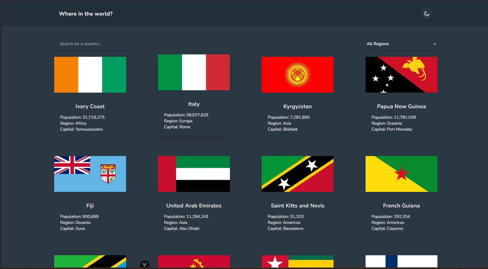

# Frontend Mentor - REST Countries API with color theme switcher solution

This is a solution to the [REST Countries API with color theme switcher challenge on Frontend Mentor](https://www.frontendmentor.io/challenges/rest-countries-api-with-color-theme-switcher-5cacc469fec04111f7b848ca). Frontend Mentor challenges help you improve your coding skills by building realistic projects. 

## Table of contents

- [Overview](#overview)
  - [The challenge](#the-challenge)
  - [Screenshot](#screenshot)
  - [Links](#links)
- [My process](#my-process)
  - [Built with](#built-with)
  - [What I learned](#what-i-learned)
  - [Continued development](#continued-development)
  - [Useful resources](#useful-resources)
  - [AI Collaboration](#ai-collaboration)
- [Author](#author)
- [Acknowledgments](#acknowledgments)

## Overview

### The challenge

Users should be able to:

- See all countries from the API on the homepage
- Search for a country using an `input` field
- Filter countries by region
- Click on a country to see more detailed information on a separate page
- Click through to the border countries on the detail page
- Toggle the color scheme between light and dark mode *(optional)*

### Screenshot

### Links

- Solution URL: [Add solution URL here](https://github.com/stephenlit/countries)
- Live Site URL: [Add live site URL here](https://stephenlit.github.io/countries/#/)

## My process

I started by setting up the core Vue structure and connecting the REST Countries API so I could get real data on the page early. After that, I focused on building the main user flow: country listing, search, region filtering, and pagination on the home page, then dynamic routing for the country detail view. Once the core features were stable, I improved the app structure by moving data logic into composables and a Pinia store, which made components easier to maintain. I then refined the UI with Tailwind, added dark/light theme support with a toggle, and finished by debugging build/dependency issues, verifying with production builds, and deploying to GitHub Pages.

### Built with

- Semantic HTML5 markup
- Tailwind (https://tailwindcss.com/)
- Flexbox
- Grid
- Mobile-first workflow
- [Vue](https://vuejs.org/) - JS library

### What I learned

Building this site taught me how to structure a Vue project into reusable parts, especially by using composables and stores to keep API logic separate from UI components. I learned how to manage routes and dynamic pages, add pagination and filtering, and improve user experience with a dark/light theme toggle and accessible UI details. I also got better at debugging dependency and build issues, then validating changes with builds and deploys so the project stayed stable as new features were added.

### Continued development

For continued development, I want to lean further into reusable components and consistent UI patterns. In this project I repeated button and input styles in multiple places, so creating shared components would improve maintainability and speed up future changes. I also want to improve test coverage for filtering, pagination, and theme switching, and spend more time refining accessibility details like keyboard focus states and semantic labels. Overall, my next goal is to make the codebase more scalable while keeping the user experience clean and responsive.

### Useful resources
- [Vue Documentation](https://vuejs.org/guide/introduction.html) - This helped me understand how to organize my app into components and composables, and I used those patterns throughout the project.
- [Pinia Documentation](https://pinia.vuejs.org/) - This helped me manage shared state for countries, filters, and pagination in a cleaner and more scalable way.
- [Vue Router Documentation](https://router.vuejs.org/) - This helped me build dynamic country detail pages and handle route-based data fetching correctly.
- [REST Countries API](https://restcountries.com/) - This was the core data source for the project and helped me implement search, filtering, and border-country lookups.
- [Tailwind CSS Documentation](https://tailwindcss.com/docs) - This helped me style components quickly and keep visual consistency while building both light and dark themes.
- [Frontend Mentor Challenge](https://www.frontendmentor.io/challenges/rest-countries-api-with-color-theme-switcher-5cacc469fec04111f7b848ca) - This helped me stay focused on required features and provided a realistic workflow for practicing frontend development.

### AI Collaboration

I used GitHub Copilot as my main AI assistant during this project to speed up development and troubleshooting. I used it to help debug build and dependency issues, improve TypeScript and Vue component structure, and refine UI details like the dark/light theme toggle and icon updates. It was especially helpful for quick iterations when I wanted to test changes, verify commands, and rewrite README sections in clearer wording. What worked well was using AI for focused, small tasks and validation; what worked less well was relying on it without reviewing context first, so I still needed to verify output and make final judgment calls.

## Author

Stephen Little

